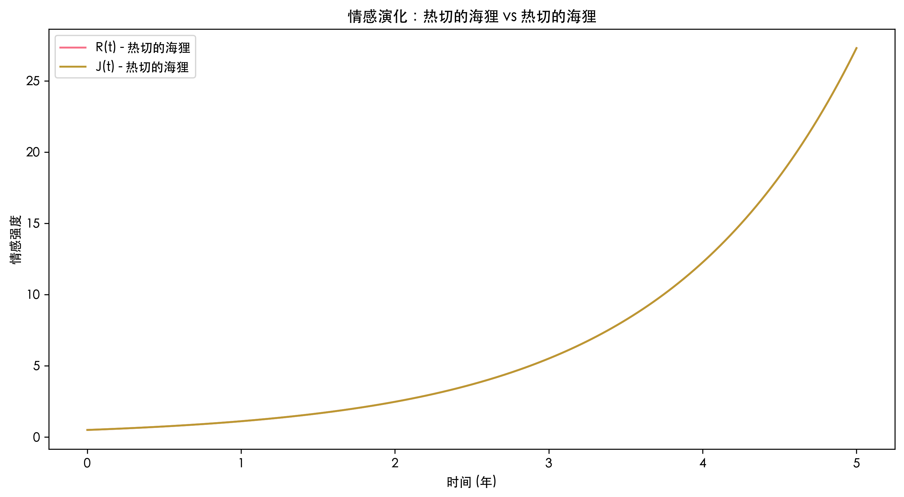

# 浪漫风格耦合模型仿真系统

[](https://www.python.org/)
[](https://opensource.org/licenses/MIT)
[](https://google.github.io/styleguide/pyguide.html)

基于微分方程和动力系统理论的人格化情感关系仿真分析系统，提供16种人格组合的动态演化预测和稳定性分析。

## 📑 目录

- [项目概述](#-项目概述)
- [✨ 主要功能](#-主要功能)
- [🛠 技术栈](#-技术栈)
- [🚀 快速开始](#-快速开始)
  - [依赖安装](#依赖安装)
  - [配置说明](#配置说明)
  - [运行系统](#运行系统)
- [🧩 核心模块](#-核心模块)
- [📊 使用示例](#-使用示例)
- [📈 可视化输出](#-可视化输出)
- [🧑💻 开发指南](#-开发指南)
- [❓ 常见问题](#-常见问题)
- [📜 许可证](#-许可证)
- [🙏 致谢](#-致谢)

## 🌟 项目概述

本系统基于Strogatz提出的浪漫关系微分方程模型，扩展实现以下工业级功能：

1. **四维人格体系建模**：量化分析热切海狸/自恋傻瓜/谨慎爱人/隐士等四种人格类型
2. **动态稳定性分析**：通过雅可比矩阵特征值计算预测关系发展趋势
3. **多维度可视化**：时间序列演化图 + 组合效应热力图
4. **生产级日志系统**：集成Loguru实现全链路追踪
5. **自动化报告生成**：300DPI科研级图表输出

## ✨ 主要功能

- **人格参数化建模**
  - 自我反馈系数 (a) 和互动反馈系数 (b) 量化配置
  - 预置四类人格的典型参数组合
- **动态系统仿真**
  - 使用RK45方法求解非线性微分方程
  - 支持自定义初始情感强度和仿真时长
- **专业级可视化**
  - 情感强度时间序列动态图
  - 16种组合稳定性热力图
  - 自动保存PNG/PDF格式图表
- **工业级特性**
  - 每日滚动日志（保留30天）
  - 异常处理与自动恢复
  - 类型注解全覆盖

## 🛠 技术栈

- **编程语言**: Python 3.8+
- **核心库**:
  - `NumPy`: 矩阵运算与数值计算
  - `SciPy`: 微分方程求解器
  - `Matplotlib/Seaborn`: 科研级可视化
  - `Loguru`: 生产级日志系统
- **开发工具**:
  - `PEP 8` 代码规范
  - `Google Style Docstrings`
  - `mypy` 静态类型检查

## 🚀 快速开始

### 依赖安装

```bash
# 克隆仓库
git clone https://github.com/yourusername/romantic-dynamics-model.git
cd romantic-dynamics-model

# 创建虚拟环境（推荐）
python -m venv venv
source venv/bin/activate  # Linux/Mac
venv\Scripts\activate    # Windows

# 安装依赖
pip install -r requirements.txt
```

### 配置说明

1. **输出目录结构**（自动创建）：
   ```
   output/
   ├── images/    # 可视化图表
   └── logs/      # 运行日志
   ```

2. **环境变量**：
   - 修改 `config/settings.py` 可调整：
     - 仿真时长 (`T_SPAN`)
     - 默认初始情感值 (`Y0`)
     - 输出分辨率 (`DPI`)

### 运行系统

```bash
# 运行主分析流程
python main.py

# 查看实时日志
tail -f output/logs/runtime_*.log
```

## 🧩 核心模块

| 模块 | 文件 | 功能描述 |
|------|------|---------|
| **核心模型** | `core/models.py` | 定义微分方程系统、人格参数类、稳定性分析算法 |
| **可视化引擎** | `core/visualization.py` | 生成时间序列图、组合热力图、格式美化 |
| **配置系统** | `config/settings.py` | 路径管理、默认参数配置 |
| **日志系统** | `utils/logger.py` | 日志格式配置、文件轮换策略 |
| **主程序** | `main.py` | 组合生成逻辑、分析流程控制 |

## 📊 使用示例

```python
from core.models import RomanticType, PersonalityParams, RomanticDynamics
from core.visualization import DynamicsVisualizer

# 创建人格参数
eager_beaver = PersonalityParams(
    a=0.5, 
    b=0.3,
    type=RomanticType.EAGER_BEAVER
)

hermit = PersonalityParams(
    a=-0.4,
    b=-0.5,
    type=RomanticType.HERMIT
)

# 初始化系统
system = RomanticDynamics(
    params_pair=(eager_beaver, hermit),
    t_span=(0, 10),  # 10年仿真
    y0=np.array([0.2, 0.8])  # 初始情感值
)

# 运行仿真
system.solve_ode()

# 可视化结果
visualizer = DynamicsVisualizer()
visualizer.plot_time_series(
    solution=system._solution,
    params_pair=(eager_beaver, hermit),
    filename="eager_vs_hermit.png"
)
```

## 📈 可视化输出

1. **时间序列图示例**：
   

2. **组合热力图**：
   

图表自动保存至 `output/images/`，包含：
- 情感强度时间演化曲线
- 特征值分布标记
- 稳定性分类图例

## 🧑💻 开发指南

### 添加新人格类型

1. 在 `RomanticType` 枚举中添加新类型
2. 在 `generate_all_combinations()` 中配置参数
3. 重新运行主分析流程

```python
# 在 models.py 中扩展枚举
class RomanticType(Enum):
    NEW_TYPE = "新人格类型"
```

### 扩展可视化

1. 创建新的可视化方法：

```python
class DynamicsVisualizer:
    def plot_phase_portrait(self, system, filename):
        """绘制相平面图"""
        # 实现绘图逻辑
        self._save_figure(filename)
```

### 日志分析

使用内置查询命令：

```bash
# 查找错误日志
grep "ERROR" output/logs/runtime_*.log

# 统计运行次数
grep "初始化系统" output/logs/runtime_*.log | wc -l
```

## ❓ 常见问题

**Q：运行时报错 `ModuleNotFoundError`**  
✅ 解决方案：  
```bash
# 确保安装全部依赖
pip install -r requirements.txt --force-reinstall
```

**Q：图表无法显示中文**  
✅ 解决方案：  
1. 安装中文字体：`sudo apt install fonts-wqy-zenhei`  
2. 清除matplotlib缓存：`rm ~/.cache/matplotlib -rf`

**Q：特征值计算出现复数**  
🔍 原因分析：雅可比矩阵存在共轭复特征根  
💡 处理方式：参考 `_classify_equilibrium()` 方法中的振荡类型判断

## 📜 许可证

本项目采用 [MIT License](LICENSE)，允许自由使用于学术和商业场景，需保留版权声明。

## 🙏 致谢

- Steven Strogatz 教授关于爱情微分方程的奠基性研究
- Google Python风格指南开发团队
- Loguru 开发者Delgan提供卓越的日志解决方案

---

**Happy Modeling!** 🚀 如有任何问题，欢迎提交Issue或联系维护团队。